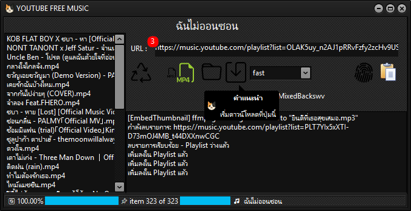

# YouTube Music Downloader (Delphi)

โปรแกรมนี้พัฒนาโดย Delphi สำหรับดาวน์โหลดเพลงและวิดีโอจาก YouTube Music หรือ YouTube โดยใช้ DLL และคำสั่งผ่าน command line ช่วยให้ดาวน์โหลดไฟล์ MP3 หรือ MP4 ได้อย่างง่ายดาย พร้อมฟีเจอร์จัดการไฟล์ เช่น เปลี่ยนชื่อไฟล์, ลบไฟล์, และแสดงรายการไฟล์ในโฟลเดอร์ที่กำหนด

---

## คุณสมบัติหลัก

- ดาวน์โหลดไฟล์จาก YouTube Music หรือ YouTube (รองรับทั้ง Playlist และ Single Track)
- เลือกดาวน์โหลดไฟล์เป็น MP3 หรือ MP4 ได้ตามต้องการ
- ตั้งค่าโฟลเดอร์ปลายทางสำหรับบันทึกไฟล์ได้ง่ายด้วย UI
- แสดงรายการไฟล์ในโฟลเดอร์ที่เลือก พร้อมเมนูคลิกขวาให้ลบหรือเปลี่ยนชื่อไฟล์ได้ทันที
- ตรวจจับการเปลี่ยนแปลงไฟล์ในโฟลเดอร์แบบ Real-time (ใช้ FileSystemWatcher)
- รองรับการสลับหน้า UI ด้วย CardPanel และ Gesture (สั่งเปลี่ยนหน้าได้ด้วยการปัดหน้าจอ)
- เก็บการตั้งค่าโปรแกรม เช่น โฟลเดอร์และสถานะสวิตช์ ลงไฟล์ config.ini อัตโนมัติ
- แสดงผลการดาวน์โหลดแบบเรียลไทม์ใน Memo พร้อมแยกแสดงข้อความสำคัญ

---

## วิธีใช้งาน

1. เปิดโปรแกรมขึ้นมา
2. กดปุ่ม **เลือกโฟลเดอร์ปลายทาง** เพื่อเลือกโฟลเดอร์ที่จะบันทึกไฟล์ดาวน์โหลด
3. ใช้ Toggle Switch เพื่อเลือกประเภทไฟล์ที่ต้องการดาวน์โหลด (MP3 หรือ MP4)
4. คัดลอกลิงก์ YouTube หรือ YouTube Music Playlist/Video ที่ต้องการดาวน์โหลด แล้วกดปุ่ม **วาง URL จากคลิปบอร์ด**
5. กดปุ่ม **ดาวน์โหลด** เพื่อเริ่มดาวน์โหลดไฟล์
6. รายการไฟล์ในโฟลเดอร์จะแสดงในหน้ารายการไฟล์ คุณสามารถคลิกขวาที่ไฟล์เพื่อ ลบ หรือ เปลี่ยนชื่อไฟล์ ได้ทันที

---

## ข้อจำกัดและคำแนะนำ

- โปรแกรมหมดอายุใช้งานได้ถึง 1 มกราคม 2027
- ต้องมีไฟล์ `youtube.dll` ซึ่งจะถูกดึงจาก Resource ในโปรแกรมหรือจากโฟลเดอร์โปรแกรม
- ต้องต่ออินเทอร์เน็ตเพื่อดาวน์โหลดไฟล์จาก YouTube
- แนะนำให้เปิดโฟลเดอร์ปลายทางที่มีพื้นที่เพียงพอสำหรับไฟล์ดาวน์โหลด

---

## ติดตั้งและพัฒนา

- เขียนด้วย Delphi VCL
- ใช้ `TIdThreadComponent` ในการทำงานแบบ background
- ใช้ `TFileListBox` สำหรับแสดงไฟล์ในโฟลเดอร์
- ใช้ Resource DLL สำหรับ youtube.dll (ต้องมีใน Resource ของโปรเจค)

---

## ตัวอย่าง Screenshot

---

## License

โปรแกรมนี้แจกจ่ายแบบ **Freeware** สามารถใช้ได้ฟรี แต่ห้ามแจกจ่ายซ้ำในเชิงพาณิชย์โดยไม่ได้รับอนุญาต

---

## ติดต่อ

- ผู้พัฒนา: ดาบดำ
- Facebook: https://www.facebook.com/Backswv
- GitHub  : https://github.com/backswvGIT

---

ขอบคุณที่ใช้โปรแกรมนี้ครับ!
ถ้ามีปัญหา หรืออยากเสนอแนะ เพิ่มฟีเจอร์ ติดต่อผมได้เลยครับ
